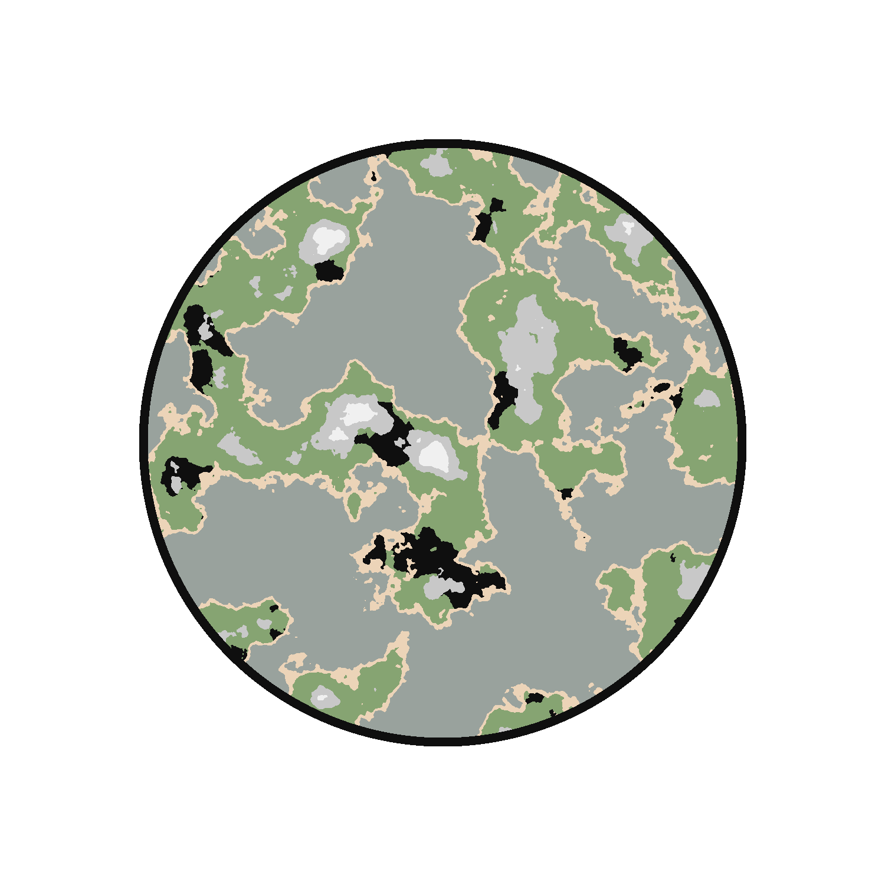

# Planet Generator

Original: https://github.com/erdavids/Island-Generator

"This project utilizes a Perlin noise library to generate a height map of values from -1 to 1. Assigning colors to different value ranges helps simulate elevation levels. With a few tweaks of the scale and offset, the resulting archipelagoes look great!"

I played around with the cool work of erdavids to randomly create planets.

First prototype with added settlement areas: 

